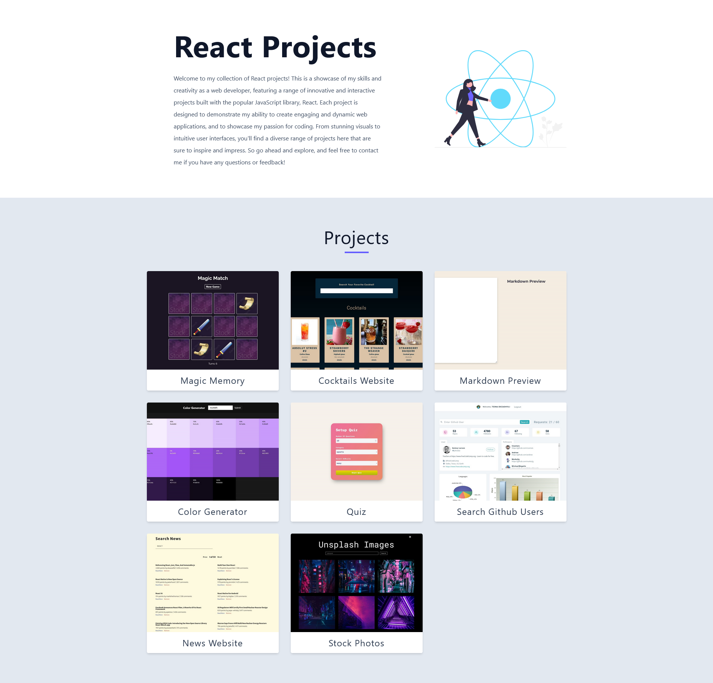

# React Projects

## Built with

- React.js
- Contentful
- Custom Hook
- useEffect
- useState
- CSS

## Users should be able to:

- Browse and explore a range of React projects, each featuring a unique set of features, functionalities, and user interfaces.
- Click on the screenshot to navigate to the project's website or live demo, where they can interact with the project's features and functionalities.
- Enjoy a seamless user experience, thanks to the efficient use of React and Contentful APIs.

## Links

- Live Site URL: [React Projects](https://react-projects-ekizashvilit.netlify.app/)
